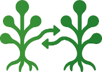
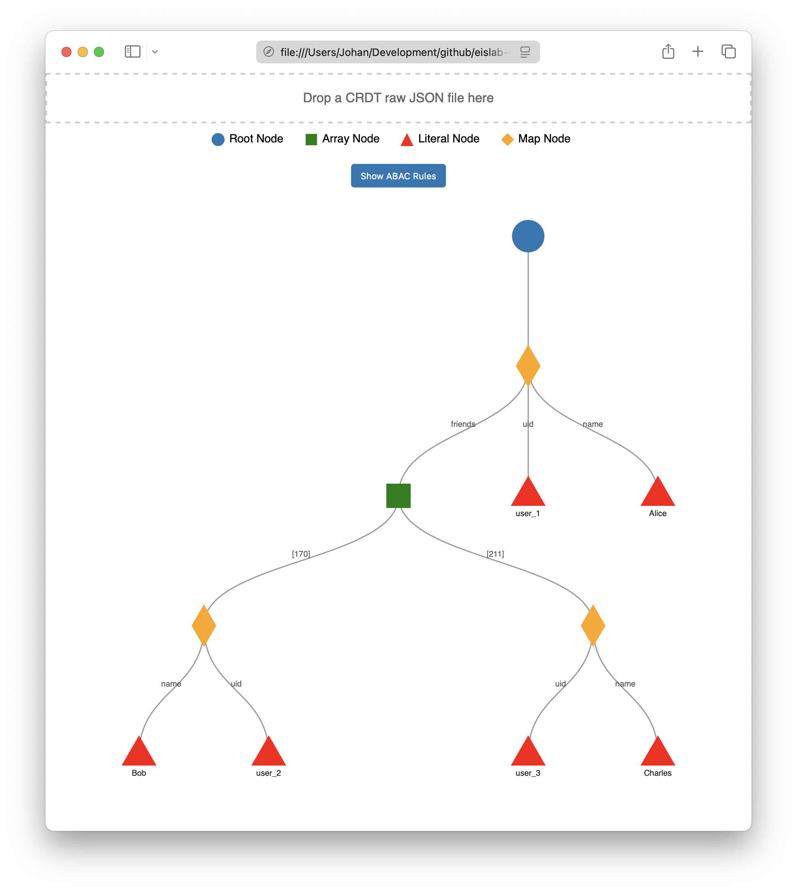

[](https://codecov.io/gh/eislab-cps/synctree)
[](https://github.com/eislab-cps/synctree/actions/workflows/go.yml)



# Introduction
**SyncTree** is a [CRDT-based](https://en.wikipedia.org/wiki/Conflict-free_replicated_data_type) [tree data structure](https://en.wikipedia.org/wiki/Tree_(abstract_data_type)) with built-in [cryptographic signatures](https://en.wikipedia.org/wiki/Digital_signature), self-sovereign identities (based on [ECDSA](https://en.wikipedia.org/wiki/Elliptic_Curve_Digital_Signature_Algorithm) with an implicit certificate model), and fine-grained access control (ABAC) — enabling verifiable, conflict-free synchronization across distributed and offline-capable systems.

**Key Properties:**
- **Fully decentralized:** No central servers, no global consensus, no trusted third parties — peers synchronize directly in a peer-to-peer fashion.
- **Conflict-free:** No need for manual conflict resolution.
- **Strong eventual consistency:** All replicas converge automatically.
- **Offline-first:** Changes can be made locally and merged later.
- **Deterministic merge:** The merge process always produces the same result.
- **Self-sovereign identity (Web3-style) & self-verifiability:** The entire CRDT tree — including identities, structure, and data — is cryptographically self-verifiable and controlled by users, with no reliance on centralized authorities. Identities are derived from ECDSA public keys using an implicit certificate model.

**Key Features:**
- **Serialization** to/from JSON.
- **Tree-structured CRDT:** Nodes can be `Map`, `Array`, or `Literal`.
- **Built-in cryptographic signatures:** Based on [ECDSA](https://en.wikipedia.org/wiki/Elliptic_Curve_Digital_Signature_Algorithm) and [SHA-3](https://en.wikipedia.org/wiki/SHA-3), using an **implicit certificate** approach (self-contained identity binding).
- **Per-node ABAC policies** with recursive inheritance.
- **Offline-capable & mergeable:** Supports merge and replay of deltas from divergent replicas.
- **JSON Pointer support:** Query the CRDT tree using JSON Pointer expressions ([RFC 6901](https://datatracker.ietf.org/doc/html/rfc6901)).
- **Event-driven programming:** Subscribe to changes in the CRDT tree and trigger actions when updates occur — enabling reactive applications and real-time integrations.

## Potential Applications
- **Collaborative editing**  
  Real-time editing of documents, code, or data structures.
- **State Reconsolidation in Edge-Cloud Computing Continuums** 
  Reconciling state across distributed systems, such as Edge-Cloud Computing continuums.
- **IoT Automation** Providing a verifiable shared state for smart home and IoT environments — where the SyncTree represents the desired state of devices (lighting, HVAC, alarms, appliances), and IoT devices subscribe to state changes and autonomously act upon them. Enables offline-capable operation, automatic state reconciliation, and auditable changes across heterogeneous IoT networks without requiring centralized cloud control.
- **Decentralized Service Registries** Enabling decentralized Service Registries and orchestration layers for distributed SOA or microservice-based architectures (e.g. [Eclipse Arrowhead](https://arrowhead.eu/eclipse-arrowhead-2)).
- **Edge Computing on Satellites and Space Systems**  
  Satellites and industrial systems often operate with intermittent or delayed connectivity. SyncTree’s CRDT-based model enables local updates and synchronization across distributed ground stations and space assets. Example use cases include configuring AI processing pipelines, managing software configurations, parameter tuning, etc.
- **Digital Asset Management**  
  Managing Digital Product Passports and other digital representations of physical assets — with fine-grained access control, verifiable provenance, and decentralized state synchronization across supply chains and stakeholders.
- **Distributed Medical Records** Enabling mergeable, trust-controlled medical records shared across multiple healthcare providers, home care services, and patients, enabling verifiable provenance of clinical actions, and offline-first operation for remote and underserved regions. 
- **Agentic and Autonomous AI Systems**  
  Supporting distributed agent-based AI systems with shared, verifiable state and fine-grained access control — enabling collaborative and adaptive AI at the edge and in dynamic environments.
- **Military and Tactical Edge Applications** Enabling decentralized orchestration of AI-enabled platforms (UAVs, UGVs, autonomous sensors), secure and verifiable mission data sharing, and resilient command and control across highly dynamic and partitioned battlefield networks.

# Theory
## What is a CRDT?
A [CRDT (Conflict-free Replicated Data Type)](https://en.wikipedia.org/wiki/Conflict-free_replicated_data_type) is a data structure designed for distributed systems, allowing multiple replicas to be updated independently and concurrently without coordination.

CRDTs guarantee that all replicas will eventually converge to the same state, regardless of the order of updates or network delays.

The CRDT in SyncTree is based on the following algorithms:
- **[Last-Writer-Wins (LWW) Register](https://en.wikipedia.org/wiki/Conflict-free_replicated_data_type#Last-writer-wins_element_set_(LWW_element_set))** — implemented using [vector clocks](https://en.wikipedia.org/wiki/Vector_clock).
- **LSEQ** — To handle merge of ordered sequences, originally designed for efficient collaborative editing. Reference: [LSEQ — An adaptive structure for sequences in distributed collaborative editing](https://hal.inria.fr/hal-00921633/document).

## Security model
In **SyncTree**, an identity is based on ECDSA cryptographic keys — the same cryptographic primitives used in many [Web3 ecosystems](https://ethereum.org/en/what-is-web3/) (e.g. Ethereum, Polkadot, Cosmos).

- The private key is a securely generated ECDSA key.
- Each change in the tree is signed with this key.
- The corresponding public key is recovered from the signature (using ECDSA public key recovery, as in Ethereum).
- The identity ID (`ownerID`) is computed as the SHA3 hash of the recovered public key.
- Each node in the SyncTree has an explicit `owner` field, which records the `ownerID` (the identity of the signer who created or last modified the node).
- In addition, vector clocks in SyncTree use the same `ownerID` to track causal history per identity.

This ensures that every part of the tree is cryptographically attributable to a specific identity, with causal tracking, fine-grained access control, and full auditability of changes.

This forms an [implicit certificate](https://en.wikipedia.org/wiki/Implicit_certificate) model: The public key does not need to be stored or transmitted explicitly — it is fully verifiable from the signature.

### Identity properties
- The identity is self-sovereign — owned and controlled by the user's keypair.
- It is portable — usable across SyncTree instances.
- It is verifiable — other peers can recover the public key from signatures and validate changes.
- It requires no centralized authority — no login, no passwords, no central server.

### How it is used in SyncTree?
- Every change to the tree is signed by a user private key.
- Each node records its owner identity and is cryptographically verifiable, ho made which change, when, and whether it was authorized.
- Vector clocks maintain per-identity causal history based on the `ownerID`.
- Fine-grained access control (ABAC) is enforced per node in the tree, also based `ownerID`.

### Important: SyncTree is not a blockchain project
- No consensus protocol is required.
- No global ledger or mining is used.
- No transaction fees are involved.
- No smart contracts are needed.

**SyncTree** is a **purely distributed data structure** — using Web3-style identity and implicit-certificate-style cryptographic signatures for verifiability and access control, designed for **lightweight, offline-capable, and peer-to-peer synchronization**.

### Relation to Decentralized Identifiers (DID)
**SyncTree** implements a **decentralized, self-sovereign identity model** inspired by [W3C Decentralized Identifiers (DIDs)](https://www.w3.org/TR/did-core/).

Each identity is derived from an ECDSA keypair:
- The `ownerID` is the SHA3 hash of the recovered public key.
- All changes to the tree are signed.
- Per-node ABAC policies are enforced based on these identities.
- The tree is fully cryptographically verifiable.

Unlike full W3C DID:
- SyncTree does not use `"did:"` URIs or DID Documents.
- No external DID resolution is required — identities are embedded and self-contained.
- Verification is purely data-driven — no dependency on external registries.

This design provides a lightweight, DID-compatible model optimized for offline-capable, peer-to-peer data synchronization — ideal for edge computing, IoT, space systems, tactical battlefield networks, and other distributed environments.

## Deterministic Merge Semantics
To synchronize a node in **SyncTree**, the following criteria must be met:

1. The tree must be structurally valid (e.g. no loops, correct format etc.).
2. All signatures must be valid — the digest is computed from the node data.
3. The recovered owner ID (SHA3 of recovered public key) must match the specified `owner` field in the node.
4. The `ownerID` must have the appropriate permissions to modify the node (or its parent), according to the ABAC policy, also embedded in the tree.
5. If the node is a Map or Literal, use vector-clock-based Last-Writer-Wins (LWW) strategy for merging:
    - Vector clocks are keyed by `ownerID`.
    - In case of equal clocks (tie), use `ownerID` as a tie-breaker for deterministic merge.
6. If the node is an Array, use LSEQ ordering combined with `nodeID` references to merge and append array elements.
7. **Special case:** If conflicting nodes are of different types (e.g. one is Map, another is Literal), convert both to Array form and merge:
    - Combine the conflicting values into an Array.
    - Sort the Array entries using `ownerID` as a deterministic ordering key across replicas.

A drawback of this approach is that conflicting changes may be overwritten in some cases (as is typical with LWW strategies). A potential future enhancement is to append conflicting versions to the tree, allowing users or applications to manually review and resolve conflicts where necessary.

## Supported Tree Operations
### Node Operations
- Identify and retrieve nodes within the tree
- Navigate the tree by path expressions
- Query values stored in the tree
- Access sibling and child nodes

### Literal Value Operations
- Store and update literal values (e.g. strings, numbers, booleans)
- Retrieve literal values

### Map Structure Operations
- Create and manage key-value mappings within a node
- Insert, update, and remove key-value pairs
- Access child nodes via keys

### Tree Structure and Topology
- Create and attach new nodes to the tree
- Manage parent-child relationships
- Define and manipulate edges between nodes

### Ordered List (Array) Operations
- Insert nodes into ordered sequences
- Append, prepend, or insert nodes relative to others
- Maintain consistent ordering across replicas

### Data Synchronization and Merging
- Merge tree replicas from different sources
- Resolve conflicts deterministically
- Ensure strong eventual consistency across distributed systems

### Serialization and Data Exchange
- Import structured data (e.g. JSON) into the tree
- Export the tree to standard formats
- Persist and restore tree state

### Access Control and Authorization
- Define and manage fine-grained access control policies
- Enforce authorization during operations and synchronization

### Event and Change Tracking
- Subscribe to changes at specific locations in the tree
- React to updates in real time

### Maintenance and Optimization
- Perform structural maintenance (e.g. cleanup, compaction)
- Optimize tree structure for efficient access and synchronization

## Getting started
### Generate a ECDSA Private key
```console
synctree key generate
```

```console
INFO[0000] Generated new private key   
Id=cd2f6d26b2ad284c8319b06c2e175f4cf2942c49cff2ae5a3f926b7541a8e92f
PrvKey=b24b6cf725a6d0e12955ff35a470c823eaac6dbbe0feb5503a097ed5baca5328
```

### Import JSON to CRDT SyncTree
```console
synctree import --json ./viewer/example.json --crdt tree.json --prvkey  b24b6cf725a6d0e12955ff35a470c823eaac6dbbe0feb5503a097ed5baca5328 --print
```

### Export back to JSON
```console
synctree export --json ./j1.json --crdt tree.json --prvkey b24b6cf725a6d0e12955ff35a470c823eaac6dbbe0feb5503a097ed5baca5328 --print
```

### Print CRDT SyncTree as JSON 
```console
synctree print --crdt tree.json --prvkey b24b6cf725a6d0e12955ff35a470c823eaac6dbbe0feb5503a097ed5baca5328
```

### Set Literal values
```console
cp tree.json tree2.json
synctree set-literal --crdt tree2.json --path /friends/0/name --value Johan2 --prvkey b24b6cf725a6d0e12955ff35a470c823eaac6dbbe0feb5503a097ed5baca5328 --print
```

### Merge two CRDT SyncTrees
```console
synctree merge --crdt1 tree.json --crdt2 tree2.json --crdtout treemerged.json --prvkey  b24b6cf725a6d0e12955ff35a470c823eaac6dbbe0feb5503a097ed5baca5328 --print
```

### Verify CRDT SyncTree
```console
synctree verify --crdt tree.json --prvkey  b24b6cf725a6d0e12955ff35a470c823eaac6dbbe0feb5503a097ed5baca5328 
```

### CRDT Viwer
**CRDT Viewer** is a tool for visualizing CRDT tree structures.  

To use the viewer:

1. Open the `viewer.html` file located in the `viewer` directory.
2. Drag and drop a CRDT file (e.g., `example_crdt.json`) into the browser window.


